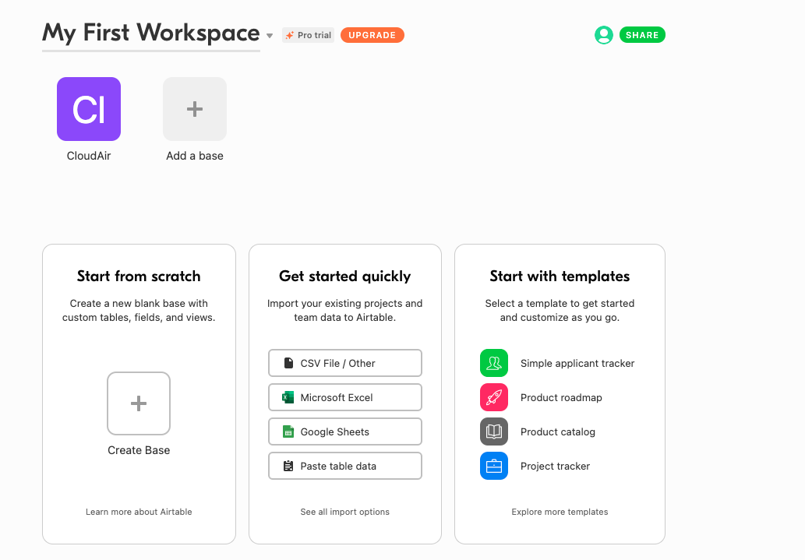
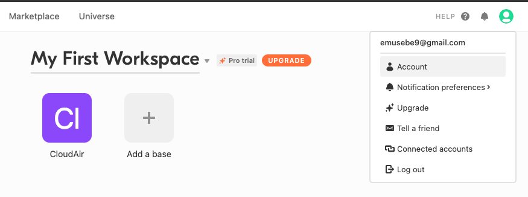
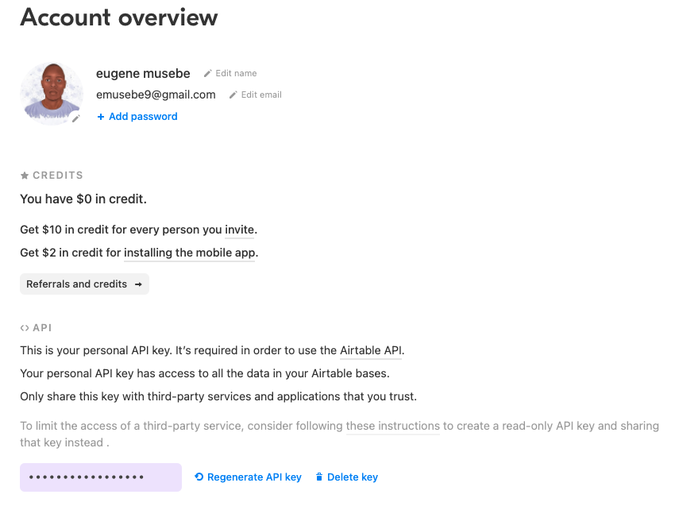
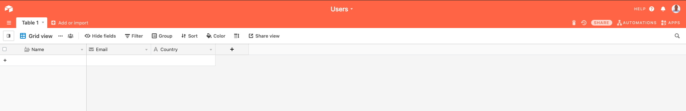

# <b>BACKGROUND</b>

In my day to day interaction with programming projects, most of my clients specify that some part of their data should be stored on an excel sheet as part of their data backup and warehousing strategy. This process takes most of my time as i have to interact with two or more data sources as per the scope of the given project.<br/>
As I did my research, I came across this awesome platform [AIRTABLE](https://airtable.com/), which could have made my work easier by providing me with a data storage facility, an API endpoint to interact with my data programmatically and a beautiful well presented UI interface that my clients could interact with their records.

In this tutorial, I will be showcasing how you can perform <b>CRUD</b> operations to your data on the Airtable platform.

Please use my referral link to create your new account as a token of appreciation for my effort. [LINK](https://airtable.com/invite/r/ATsRy46j)

## <b>What is Airtable</b>

Airtable is an easy-to-use online platform for creating and sharing relational databases. The user interface is simple, colorful, friendly, and allows anyone to spin up a database in minutes. You can store, organize, and collaborate on information about anything <br/>

In this article, We will explore on how to manipulate a base(Airtable's word for a database) through its simple REST API to perform the basic CRUD (Create, Read, Update, and Delete) operations on the data stored.

## <b>AIRTABLE'S KEY CONCEPTS</b>

- <b>A Base</b>: A base is a database that contains all of the information you need for a specific project, and is made up of one or more tables. <br/>
  Bases are made up of one or more tables, which are essentially like different sheets or tabs of a spreadsheet.

- <b>A Table</b>: This is one set of data, organized in columns

- <b>A View </b>: This is a particular representation of a table. You can have the same data presented in different views.

## <b>Getting Started</b>

After creating an Airtable account, you will be presented with a list of sample bases(Databases) that you can use to quickstart a new project. You can also start from scratch by selecting a workspace, and clicking the Add a base or create a base button as displayed in the image below.



Incase you have existing data in a spreadsheet, you can also import the data to airtable.

## <b>Authentication</b>

Airtable comes with a simple REST API to perform the basic CRUD operations on the data stored. You'll need to have a base i.e. a table/ sheet set up before you can start to programmatically manipulate the database.

After creating your table/sheet structure, you will need to get an **API Key** for verification purposes when accessing the base(Database) programmatically. This can be accessed by clicking the account link that is found under the user icon image as displayed below.



After clicking the icon, you will be redirected to your account's settings page where you will find your API key as shown below. Copy the key and store it in a safe place as we shall use it in the coming steps.

` Do not share your KEYS with anyone. Incase they get exposed, kindly delete and regenerate new API keys.`



The last thing we need to do before we can interact with our base programmatically is to create a table that we can manipulate from our codebase.
The name of our table will be <em>Users</em> and the properties inside the table will be <b>Name</b> - Long Text, <b>Email - Email</b> and <b>Country - Single line text</b> as displayed below.



😀 <em>Talk is cheap, show me the code</em> 😀

## APPLICATION CODEBASE SETUP

A basic Node application contains a <b>.js</b> file and a <b>package.json</b> file. which is used to list your project dependencies and start scripts.

To generate a package.json file in your application, navigate to your project folder via the terminal or git-bash for windows users and type the following command :

```js
npm init || npm init -y
```

Using npm init without the flag -y will generate some questions that will be able to give a clear description of your application and its dependencies.

### Installing Dependencies

Run this command to install the required dependencies :

```js
npm i express cors  body-parser airtable dotenv
```

The above command will install the following dependencies :

- <b>express :</b> A web application framework for Node.js.
- <b>body-parser :</b> A middleware that handles post requests in express.
- <b>airtable :</b> Nodejs airtable library.
- <b>cors :</b> Handles cors headers.
- <b>dotenv :</b> A module that loads environment variables from a .env file into process.env.

After the installation, lets create our `app.js` file. This is where we shall setup our express server.

Add the following code to the created file :

```js
const express = require('express');
const app = express();
const cors = require('cors');
const bodyParser = require('body-parser');

app.use(cors());
app.use(bodyParser.urlencoded({ extended: false }));

app.get('/', (req, res) => res.send('Hello from Airtable'));

const PORT = process.env.PORT || 5000;

app.listen(PORT, () => {
  console.log(`Server running on ${PORT}`);
});
```

To start the server use the command :

```js
node app.js
```

When you visit the Url: `localhost:5000`, you should be able to see the string 'Hello from Airtable' running on your browser.

In order to interact with Airtable programmatically , we will have to bring the `API key`, `Airtable base id` and `Airtable table name` into the project.
As this can be sensitive information that need not to be shared with everyone, create a `.env` file in the root project folder and fill the values associated with each key.

All the information can be obtained from your airtable project as we did the setup above.

```js
AIRTABLE_API_KEY = xxxxxx;
AIRTABLE_BASE_ID = xxxxxx;
AIRTABLE_TABLE_NAME = xxxxxx;
```

In order to interact with Airtable within our application without having to repeat the same code everytime in different files, we will create a `utils` folder where we shall put the `airtable.js` file.

This will enable us achieve the principle of `don't repeat yourself` by reusing the file anytime we need to make use of it.

`If you have to repeat a block of code, then it should be a function. Don't repeat yourself.`

Create an `airtable.js` file inside the utils folder and add the following to it.

```js
require('dotenv').config();
const Airtable = require('airtable');

Airtable.configure({
  apiKey: process.env.AIRTABLE_API_KEY,
});

const base = Airtable.base(process.env.AIRTABLE_BASE_ID);
const table = base(process.env.AIRTABLE_TABLE_NAME);

module.exports = {
  base,
  table,
};
```

From the code above, I imported the `dotenv` package in order to access the environment variables stored in the `.env` file.
I then initialized and configured the Airtable library which enabled me to create and export variables that will enable one access the base and table globally within the application.

To start interacting with the base, navigate back to the server file `app.js` and import the configurations above by adding the following at the imports section.

```js
const { table } = require('./utils/airtable');
```

## CRUD (Create, Read, Update, Delete)

Let’s now see how to perform some very common data operations.

## Create a record (User)

You can add a new record by calling the `create()` method on the table object. You pass an object with the field names (you don’t need to pass all the fields, and the ones missing will be kept empty).
In this case, if there is an error we just log it, and then we output the id of the row just entered.

```js
app.post('/create', async (req, res) => {
  await table.create(
    {
      Name: ' Ian',
      Email: 'test@gmail.com',
      Country: 'Kenya',
    },
    (err, record) => {
      if (err) {
        console.error(err);
        return;
      }
      console.log(record.getId());
      return res.json(record);
    }
  );
});
```

When we visit [postman](https://www.postman.com) and make a post request to the `/create` endpoint the above data will be posted to the spreadsheet we created as displayed below :

<iframe class="airtable-embed" src="https://airtable.com/embed/shrep1QznxiR62v7w?backgroundColor=orange&viewControls=on" frameborder="0" onmousewheel="" width="100%" height="533" style="background: transparent; border: 1px solid #ccc;"></iframe>

## Get/Read A Specific Record

You can get a specific record by using the find() method on the table object, passing a record id:

```js
// GET A SINGLE RECORD
app.get('/single', async (req, res) => {
  const id = 'record_id';
  table.find(id, (err, record) => {
    if (err) {
      console.error(err);
      return;
    }
    /* here we have the record object we can inspect */
    console.log(record);
    return res.json(records);
  });
});
```

From the record object returned by find() one can get the following record content:

```js
record.get('Name');
record.get('Email');
record.get('Country');
```

## GET ALL RECORDS

```js
app.get('/all', async (req, res) => {
  const records = await table.select({}).firstPage();
  console.log(records);
  return res.json(records);
});
```

## Update a Record

To update a record, call the update() function and pass the ID of the record and the fields you want to update.

```js
app.patch('/update', async (req, res) => {
  const id = 'record_id';
  await table.update(
    id,
    {
      username: 'John',
    },
    (err, record) => {
      if (err) {
        console.error(err);
        return;
      }
      console.log(record.get('username'));
      return res.json(record.get('username'));
    }
  );
});
```

## Delete a Record

To delete a record, call the destroy() and pass the ID of the record you want to delete.

```js
app.delete('/delete', async (req, res) => {
  const id = 'rectHNeBP4u36mL6m';
  await table.destroy(id, (err, record) => {
    if (err) {
      console.error(err);
      return;
    }
    console.log('Deleted record');
    return res.json('Deleted Record');
  });
});
```

## Pagination

If you do have more than 100 items in your table, to get access to the other records you have to use the pagination functionality. Instead of calling firstPage() you call eachPage(), which accepts 2 functions as arguments.

I hope this article has been able to enable you understand and get started with Airtable.

The source code to this article can be found [Here](https://github.com/musebe/AIRTABLE_CRUD)

For further clarification, feel free to contact or comment.
