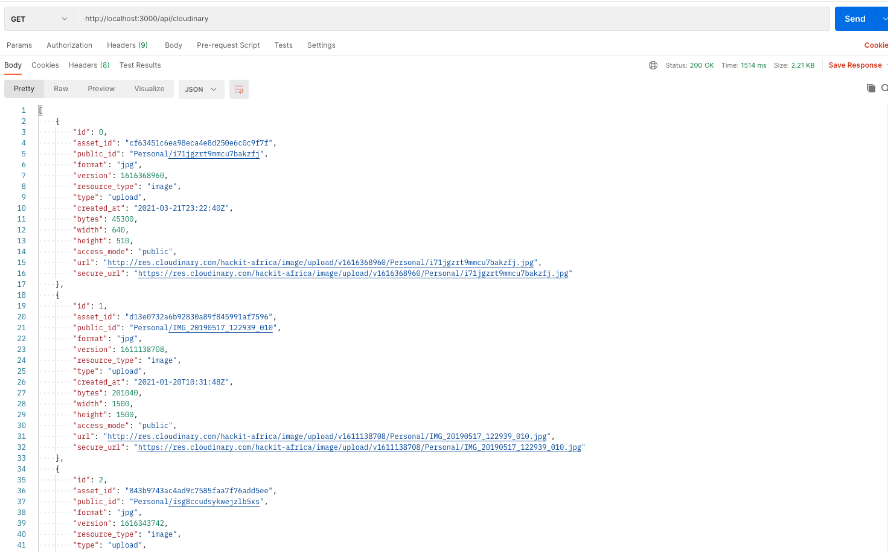

# **BACKGROUND**

An image carousel is a great way to showcase specific images on your website. This can enhance the overall visual appearance of your website and also improve the general user experience.

In this article, you'll learn how you can prototype a simple image carousel using [Cloudinary](https://cloudinary.com/), [Next.js](https://nextjs.org/), and [Framer-Motion](https://www.framer.com/api/motion/) as illustrated in the Codesandbox below.

<iframe src="https://codesandbox.io/embed/image-framer-motion-93owf?fontsize=14&hidenavigation=1&theme=dark"style="width:100%; height:500px; border:0; border-radius: 4px; overflow:hidden;"title="Image-Framer-Motion"allow="accelerometer; ambient-light-sensor; camera; encrypted-media; geolocation; gyroscope; hid; microphone; midi; payment; usb; vr; xr-spatial-tracking"
  sandbox="allow-forms allow-modals allow-popups allow-presentation allow-same-origin allow-scripts"></iframe>

## **Prerequisites**

Before getting started, ensure you have the following installed:

- Installed [Node.js.](https://nodejs.org/en/)
- Basic understanding of JavaScript/React
- [Cloudinary Account](<(https://cloudinary.com/signup)>)

## **Project Setup**

To get started with next.js, navigate to the project directory of your choice and run :

```js
npx create-next-app carousel
```

The command will set up everything automatically for you. After the installation is complete, follow the instructions on your terminal to start the development server.

### **Set Up Dependencies**

Install the following dependencies in your project:

```
npm i cloudinary react-icons framer-motion
```

The Cloudinary package installed will be used by the carousel to interact with the images stored in cloudinary while react icons will be used to display image navigation arrows on the carousel.
The framer motion package will be used to animate the fetched images.

As we shall be using cloudinary for retrieval of the carousel images, create a [.env.local](https://nextjs.org/docs/basic-features/environment-variables) file in the root of the project directory. This is where we shall store all our environment variables configurations. Content stored in this file are not included in the browser build. This file should always be included in your `gitignore` file as it stores sensitive information.

To the file add the following keys :

```.env.local
CLOUDINARY_CLOUD_NAME=
CLOUDINARY_API_KEY=
CLOUDINARY_API_SECRET=
```

Their respective values shall be acquired from the [Cloudinary](https://cloudinary.com/users/login) dashboard.

## **Cloudinary setup**

Once you have created an account on Cloudinary, from the dashboard, copy your `cloud_name, api_key & api_secret` and add them as values to the respective keys in the `.env.local` file created in the application.

The next step is to create a folder where all the carousel images will be stored. Click on the Media Library tab and create a folder, name it `Carousel` as we shall programmatically access the contents of the folder.

The last step is to upload images you would want to see on the carousel to the folder. For demo purposes, you can download free stock photos from [Pexels](https://www.pexels.com).

To interact with the images stored in Cloudinary from the application, create a `utils` folder in the root project structure of your application and add a `cloudinary.js` file in it.

This file shall be used to store all the snippets that you will use throughout the application to interact with cloudinary.

Paste the following to the file:

```cloudinary.js
import cloudinary from 'cloudinary';

cloudinary.config({
  cloud_name: process.env.CLOUDINARY_CLOUD_NAME,
  api_key: process.env.CLOUDINARY_API_KEY,
  api_secret: process.env.CLOUDINARY_API_SECRET,
});

```

From the code above, we imported the cloudinary package and configured the required configuration keys to access all the assets stored in cloudinary. By using `process.env` one can access values stored in the `.env.local` file.

The next step is to create an asynchronous function that will fetch all images from cloudinary :

```cloudinary.js
export async function getAllImages() {

  const response = await cloudinary.v2.api.resources({
    type: 'upload',
    prefix: 'Carousel',
  });

  const sliderData = response.resources.map((image, key) => ({
    id: key,
    ...image,
  }));

  return sliderData;
}
```

By using `cloudinary.v2.api.resources`, one can manage and access all the resources(images) stored in the `Carousel` folder. After querying the Images stored in the folder, convert the json response received into an array of objects for easy image mapping when it comes to fetching data on the frontend.

The last configuration we need to make for the next.js application to communicate with cloudinary effectively is to create a `next.config.js` file in the root project structure and add the following to it.

```next.config.js

module.exports = () => {
  return {
    images: {
      domains: ['res.cloudinary.com'],
    },
  };
};

```

This will allow us to let Cloudinary optimize images as opposed to Next's built-in image optimization.

With all the above setup and configurations, it's time to spin up the server.

## **Server setup**

Next.js supports writing server-side code rendering out of the box. For this to happen, navigate to the page's directory and create an `api` folder. Inside it, create a `cloudinary.js` file and paste the following :

```cloudinary.js
import { getAllImages } from '../../utils/cloudinary';


async function handler(req, res) {
  if (req.method === 'GET') {
    try {

      const sliderData = await getAllImages();

      res.status(200).json(sliderData);

    } catch (error) {

      res.status(500).json({ message: 'Getting images failed.' });
    }
  }
}

export default handler;
```

From the above, we first import the `getAllImages` function we created in the utils folder to be able to access all the images stored in cloudinary, then created an if statement to define the method `GET` to fetch data from the defined endpoint.
Then create a `try & catch` statement where we assign the `getAllImages` function to the variable `sliderData` to fetch the data or catch all the errors that might occur in the process of fetching the images from cloudinary. Lastly, we export the function so that it is globally available.

To test out if the endpoint works. visit your browser or [postman](https://www.postman.com) and make a `GET` request to endpoint ` http://localhost:3000/api/cloudinary`. This should produce the following response :



## **Image Slider Component**

To be able to consume the Api we created and show all the data to the application users, create a components folder on the root of the application and add an `ImageSlider.js` file to it. This will be a normal react component.

#### **Component setup**

This component will be used to fetch all the images from cloudinary and showcase them in an image slider. We shall use the `Fetch API` to perform data fetching from the API and reacts `useState` to set the images into the page state.

Create a functional component as follows:

```ImageSlider.js

import React, { useState } from 'react';


 let images = [];

 fetch("/api/cloudinary")
    .then((response) => response.json())
    .then((data) => {
      images = data.map((image) => {
        return image.url;
      });
  );

const ImageSlider = () => {
const [[page, direction], setPage] = useState([0, 0]);
const imageIndex = wrap(0, images.length, page);


  return (

  );
};

export default ImageSlider;
```

Above, we first declared images as an empty array after which we used the `Fetch ` API to get all the images from Cloudinary and store them into the images variable.

Each fetched image will be displayed on a separate page hence storing all the pages in the application state. This will enable us to loop through the different images from the API once the application state changes.

To be able to navigate through the different Images, create a function that will shift the pages(image) based on the direction triggered as illustrated below :

```pagination
 const paginate = (newDirection) => {
    setPage([page + newDirection, newDirection]);
 };
```

Then, create a variable that will store all the images based on their indexes so that the different image pages can be displayed on the Next.js image component:

```src
const src = images.length > 0 ? images[imageIndex] : `/amazon.jpg`;
```

#### **NEXT.JS IMAGE OPTIMIZATION**

To optimize how we load, optimize and resize images on various screen sizes, we utilized the [image component](https://nextjs.org/docs/basic-features/image-optimization) which resizes all the carousel images on the fly.

We must first import the image component on top of the page in order to use it:

```import
import Image from 'next/image';
```

Create a div in the return statement and add the following code to display the various image pages based on their indexes:

```image-component

  <Image
   src={src}
   alt="Picture of the author"
   width={600}
   height={600}
  />
```

#### **Animating The Image Carousel With Framer Motion**

[Framer motion](https://www.framer.com/api/motion/) is a powerful and easy-to-use library that can quickly help us achieve smooth image pages transition effects. It allows us to combine a variety of animation types and can serve as a solid foundation for making your pages even more user-friendly.

Importing the motion component and the other animation components that come with the library is the first step in using it.
In our case, we'll make use of the `AnimatePresence` component.

Fontawesome imports will be used to create navigation icons.

```imports
import { motion, AnimatePresence } from "framer-motion";
import { FaAngleRight } from "react-icons/fa";
```

The next step is to wrap everything inside the return statement with the AnimatePresence component. By changing the different keys within the component it will created an Animated slideshow.

Create a div between the Animate presence component and Add the following to it :

```AnimatePresence
<AnimatePresence>
<motion.div
  className={styles.img}
  key={page}
  custom={direction}
  initial={{ x: 300, opacity: 0 }}
  animate={{ x: 0, opacity: 1 }}
  exit={{ opacity: 0 }}
  whileHover={{ scale: 1.1 }}
  whileTap={{ scale: 0.9 }}
  transition={{
    x: { type: "spring", stiffness: 300, damping: 300 },
     opacity: { duration: 1 }
  }}
>
 </motion.div>
</AnimatePresence>
```

Move the image component between the `motion div` for the transitions and animations applied to take effect to the optimized images.

Above we utilized transitions, whileHovers, whileTap and the animate properties from framer motion to give the image carousel a smooth transition

We need to add back and forward navigation buttons below the AnimatePresence component to complete the component. This will be accomplished in the following ways:

```buttons
<motion.div
  className={styles.next}
  onClick={() => paginate(1)}
  whileHover={{ scale: 1.2, transition: { duration: 0.5 } }}
  whileTap={{ scale: 0.9 }}
>
  <FaAngleRight />
</motion.div>
```

```
<motion.div
  className={styles.prev}
  onClick={() => paginate(-1)}
  whileHover={{ scale: 1.2, transition: { duration: 0.5 } }}
  whileTap={{ scale: 0.9 }}
>
  <FaAngleRight />
</motion.div>
```

By using the motion property on the button `divs` above we were also able to animate the navigation buttons when we hover and tap on them. We used Fontawesome to create the navigation signs inside the buttons.

## **Image Display**

To display the `ImageSlide.js` component we just created, navigate to the pages folder and on the default `index.js ` file, create a `Homepage` function and embed the image slider component as shown below.

```Homepage.js
function HomePage({ sliderData }) {
  return (
    <Layout>
      <ImageSlider/>
    </Layout>
  );
}
```

## **Conclusion**

You have successfully built an image carousel leveraging on Framer Motion, Next's massive capabilities such as out-of-the-box API & image component while using cloudinary as your image storage and manipulation tool.

Feel free to improve the application and make it better.

For reference visit:

- [Next's Documentation](https://nextjs.org/docs)
- [Digital Asset Management Training](https://training.cloudinary.com)
- [Admin API reference](https://cloudinary.com/documentation/admin_api)
- [Framer Motion API](https://www.framer.com/api/motion)
