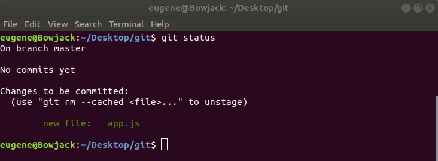
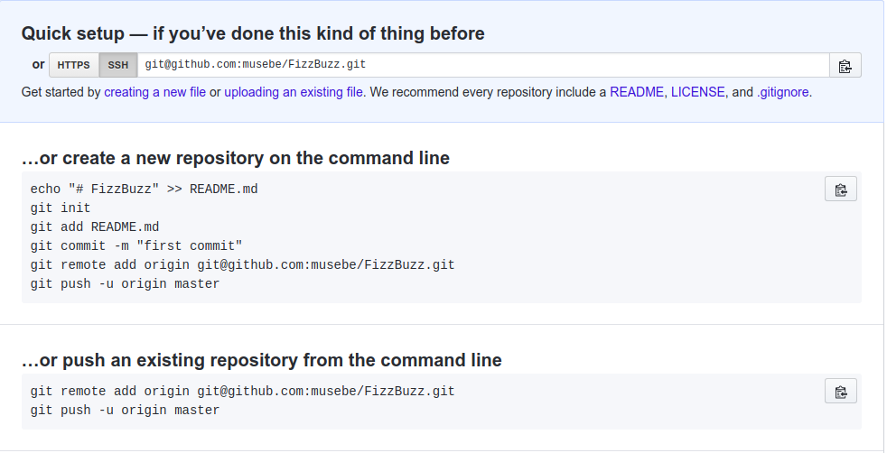

# **Introduction**

To many beginners getting into software development, tooling can be a very difficult process to understand. You tend to get confused when you get to hear someone mention “GIT” and at the same time “GITHUB”.Well not anymore!!!
I am going to try as much as possible to explain to you the difference between the two terminologies and their applications in the software development lifecycle.

This guide aims to give you a grasp and understanding of the basic terminologies and commands you’ll frequently use in your day to day activities as a software developer.

## **What is version control?**

I will start by explaining the bombastic word _“version control”_ which will lead us to a better understanding of the role played by git.

Version control is a system that records changes to a file or set of files over time so that you can recall specific versions later.

## **What is Git?**

I came to learn of git some years back when I was working on a client’s project using an old laptop that was termed a moving desktop by my friends due to its inability to save power (Faulty battery). Upon electricity going off, I lost all the work I had done as I had not had enough time to save my work. Imagine losing two days of work, in my case “Lines of code”. Painful, right ??

Since desperate situations need desperate measures, I did my research and came across an awesome tool that has completely changed how I track my code.

Git is a distributed version control system for tracking changes in your source code during software development. This means your local copy of the code is a complete version control repository.

A repository has **commits** of the project or a set of references to the commits called **heads**. All this information is stored in the same folder as the project in a sub-folder called **.git** and will mostly be hidden by default in most systems.

After doing **commits** to your code you can then do a git push to either Github, Gitlab or Bitbucket which are hosting services for version control.+

### **Getting started.**

To get started with Git, you have to download and install the tool on your local machine. Head over to [https://git-scm.com](https://git-scm.com) and download the version that is compatible with your operating system. For Windows users, you will be using the Git Bash program. It will utilize all the same commands as Terminal. After the installation, run the command: `$ git --version`. This command will show you which version of git is installed on your system.

In order to use the terminal or git bash, familiarity with the basic command-line commands is important. Below are some of the most important commands, you will need to know to get started.
Basic command line reference

- `pwd`: Print Working Directory – shows the exact directory you’re working in.
- `ls` : List Directories – lists all the files and folders in your current directory.
- `cd`: Change Directory – change to another directory.
- `mkdir`: Make Directory – create a new directory.
- `touch`: Create a new file.
- `pwd` : Print working directory -Shows your current working directory.

After familiarizing yourself with the basic command line commands, navigate to the directory of your choice on your terminal and create a folder. This can be achieved using:`cd Desktop`.

Directories are case sensitive. Make sure you capitalize their names as indicated. The above command changes my working directory to the desktop. This is where I will be creating my applications folder.

Create a folder and give it your choice of name using the following command: `mkdir FizzBuzz` `**“FizzBuzz”**` will be the name of my folder as I will be writing a program that prints the numbers from 1 to 100. For multiples of three, it will print “Fizz” instead of the number and for the multiples of five it prints “Buzz”. For numbers which are multiples of both three and five, it will print “FizzBuzz”.

The main focus of this article is to learn Git and Github. The above algorithm is what I choose to demonstrate how I will be tracking my program.

Navigate into the “FizzBuzz” folder using the command `cd FizzBuzz` and create a file with the name “app.js”. Using `touch app.js` will create the file. Add the following lines of code to the file.

```app.js
for (const i < 101; i++) {
  if (i % 15 == 0) console.log(“FizzBuzz”);
  else if (i % 3 == 0) console.log(“Fizz”);
  else if (i % 5 == 0) console.log("Buzz");
  else console.log(i);
}
```

## **Initialize Git repository.**

In order to track our code, we need to add Git to our project folder. This will be achieved using the following command :

```git
  git init
```

This command will create a git folder in your working directory. The folder is always hidden. You can view it using the command **“ctrl+H”** on Windows and Linux based operating systems.

## **Add all files to the repository**

Now it knows that there is a file in the directory, but they’re not a part of the Git repo. At this point, we have to track the files with the `add` command. This can also be termed as (Staging).

> All git commands are case sensitive.

```git
git add .
```

The period **(.)** means everything in the folder should be added to the git repository. In cases where you only want to track a single file, you can specify the names of the files you want to be tracked. In our case, you can use the command :

```git
 git add app.js
```

To check the status of our file we will use the command: `git status`. As at now your git bash or terminal should look like this.



## **Commit tracked files to the master branch**

To commit the changes to master, use the following command.

```git
 git commit -m "Commit message"
```

The command `“git commit”` is able to put all your changes into the local repository while the -m flag specifies that what follows is the commit message. This is a custom message intended to let your future self or other developers know what was added in that commit.

## **Uploading your code to GitHub.**

As of now, our codebase is ready to be pushed to your online repository of choice. The purpose of doing this is to either make our codebase accessible online, collaborate on your project with other developers or store your codebase somewhere secure for future reference.

## **Creating a Github Account**

[Github](https://github.com/) is the most popular location to host repositories, so go ahead and make an account there if you haven’t already.

Once you’ve made your account, create a repository by clicking Add New Repo. Do not initialize with a README, .md or .gitignore file at this point. We can call the repository “FizzBuzz” as our project solves the FizzBuzz algorithm. Your repository has been created at `github.com/you/project`. It should be completely empty.

## **Configure your global Git account.**

Git uses a username and email address to associate commits with an identity. On your terminal, run the following commands and replace the dummy credentials with your personal details.

```config
git config — global user.name “Firstname Lastname”
git config — global user.email username@email.com
```

To confirm that you have set the Git username correctly, run the following commands :

```config
git config user.name
git config user.email
```

## **Hook up the local directory with the repo we made at [Github](github.com).**

To link your remote git repository to your online repository on GitHub, BitBucket or Gitlab. You need to attach an **origin** to your remote git project to specify the origin will be hosted online. You’ll use this command.

```git
git remote add origin https://github.com/you/project
```



The above remote origin link can be found on the repository you created online as shown on the picture below :

## **Push the files to the Git repo at [Github](github.com).**

To push the code to your repo, use the following command.

```git
 git push origin master
```

Refresh your GitHub page. Success! All your files are now hosted at Github.com!

To pull the code from a different machine, you’ll initialize an empty git repository then use the following command to pull the repo.

```git
git pull https://github.com/itonnie/repositoryname.git
```

This will make a copy of your project on the machine you are using.

👏 👏 👏. Congratulation on reaching this far !!! With the basic commands indicated in this article, you can now share your code with a team of developers, keep track of their changes, commit changes to your project, and authorize contributors. these are very useful activities in a developers day to day life.

Don't forget to leave a comment. It really encourages me to write more.

## **References and Learning Material**

- [Youtube](https://www.youtube.com/watch?v=MJUJ4wbFm_A&t=749s): An Introduction to Git and GitHub by Brian Yu
