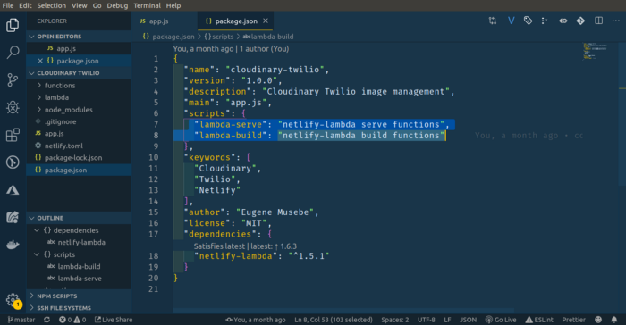
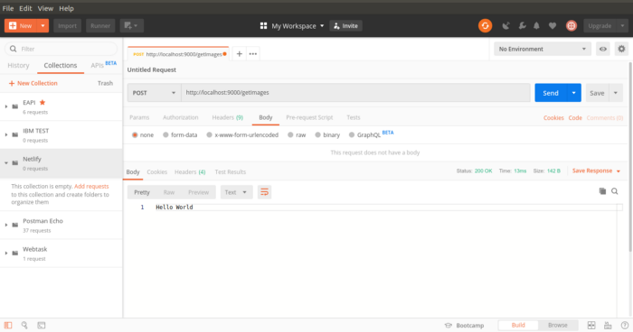
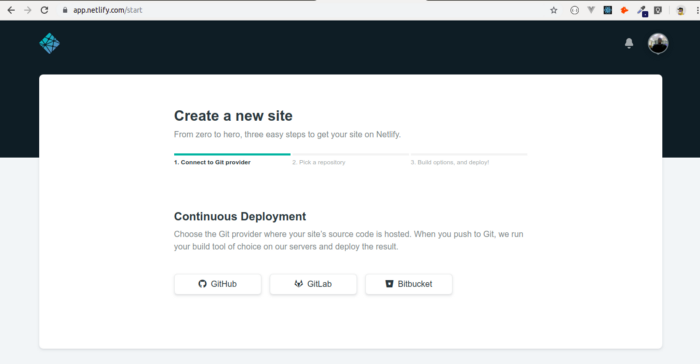

# What is serverless computing?

<b>Serverless computing</b> is a cloud-computing execution model in which the cloud provider runs the server, and dynamically manages the allocation of machine resources. Pricing is based on the actual amount of resources consumed by an application, rather than on pre-purchased units of capacity.

In this article, we are going to focus on Netlify cloud functions. It’s assumed that you have an understanding of how to use Javascript and Netlify to build a Continuous Deployment from a Git repository. If you don’t have much/any experience with Netlify, follow the [link](https://scotch.io/tutorials/get-started-with-netlify-the-simplest-way-to-deploy-your-javascript-apps) to a Netlify guide to get started.

## Getting Started

To get started, create a folder on the directory of your choice, navigate to the folder and execute the following command on your terminal.

```js
npm init -y
```

This will generate a <b>package.json</b> file that will list all your project dependencies.

For this project, we shall only be using the package Netlify lambda to demonstrate how we can locally develop Netlify functions and deploy them to Netlify servers. Run the following command on your terminal to install the package.

```js
npm i netlify-lambda
```

After the installation is done, you need to configure the build and deploy scripts. This is done in the package.json file under the scripts section as displayed on the highlighted code below.



We need to create a folder that contains all of our Lambda Functions. It doesn’t really matter where you put the folder or what you call it, I’m going to put mine in the root of my app and call it <b>functions</b>.

For each lambda function, we need to create a new javascript file that will perform the assigned task. i will call my file <b>“getImages.js”</b>.

Netlify Cloud/Lambda function takes in three parameters :

1.<b>Event</b>: Where we can retrieve post data, headers.<br/> 2.<b>Context</b>: Information about the context in which the function was called, like certain user information.<br/> 3.<b>Callback</b>: A function that we call to return a response to the user.

The first parameter that the callback function takes is an error, which is always null if there is no error. If the error is present, it will be handled and sent back to the user with the defined error message else the second parameter as defined in body section will be returned.

Add the following function to the <b>“getImages.js”</b> file :

```js
exports.handler = function (event, context, callback) {
  callback(null, {
    statusCode: 200,
    body: 'Hello World',
  });
};
```

When the above function is executed it will return a response with the status code of <b>200</b> which indicates that everything is OK. The end-user will be able to receive the message <b>“Hello World”</b> which is appended to the body.

The last thing we need to do before we can run the function locally is to create a configuration file that tells Netlify where to serve the functions from. This is not the directory where we write our source code.

When we run the command <b>“npm run lambda-serve”</b> as documented in the <b>“package.json”</b> file, the source code will be compiled and the built assets will be put in the folder that we specify. So, create a <b>netlify.toml</b> file in the root of your directory that looks like this.

```js
[build];
functions = 'lambda';
```

This tells Netlify that when our functions are built the assets generated should be stored in a directory called <b>“lambda”</b>.

To test the application run the command :

```js
npm run lambda-serve
```

The above command will generate a folder with the name <b>“lambda”</b> as declared in the netlify.toml file. Inside the folder, a minified version of the “getImages” file will be generated. The minified version of the function is the one that we shall deploy to netlify.

After the above command is executed on your terminal, you can test your function by visiting postman and making a <b>GET</b> request to the URL http://localhost:9000/getImages. This will produce the following response.



## Deploying the lambda/cloud Function

Netlify provides us with an easy continuous deployment feature that when we link a Github repository to netlify, the two will always be in sync as soon as we push our code to Github.

To initialize git in the project and make the first commit run the following commands :

```git
git init
git add . && git commit -m "first commit"
```

After the above is done head over to Github, create a project and push the source code to the repository.

If you haven’t made a Netlify account yet, [sign up here](http://netlify.com). After signing up, you’ll be redirected to your dashboard, which shows your list of deployed sites. If you haven’t used netlify, it’ll be empty. Click the top right button, <b>New site from Git</b>.


You’ll be switched to the next screen, where we will choose Github as our Git provider. You’ll be presented with a pop-up window and to provide Netlify with access to your Github account for it to access your github projects.



After Authentication, you will view all of your current Github repositories. If you are working with a company repo, you can click your name to dropdown a list to choose other repo’s (you must be listed as a contributor on that repo).

Select the repository you created then the publish directory and build command you supplied in the netlify.toml file should be prefilled.

If you followed all the steps correctly, you’ll see Site deploy in progress switch to green, and display your new URL.

When you click on the URL provided you will land on an error page. This is because we are not trying to access a deployed website but the deployed lambda function. To be redirected to the cloud function, structure your URL in this format :

```url
https://[YOUR_URL]/.netlify/functions/[YOUR_FUNCTION_NAME]
```

Test your URL on postman and you should be able to get the same response like the one you got on your local machine.

## <b>Conclusion</b>

With Cloud Functions, you can write simple, single-purpose functions that are attached to events emitted from your cloud infrastructure and services. Your Cloud Function is triggered when an event being watched is fired. Your code executes in a fully managed environment. There is no need to provision any infrastructure or worry about managing any servers.

Watch out for the next article as we shall be building something cool using cloud functions.

The source code to this article can be found [HERE](https://github.com/musebe/lambda_function)
