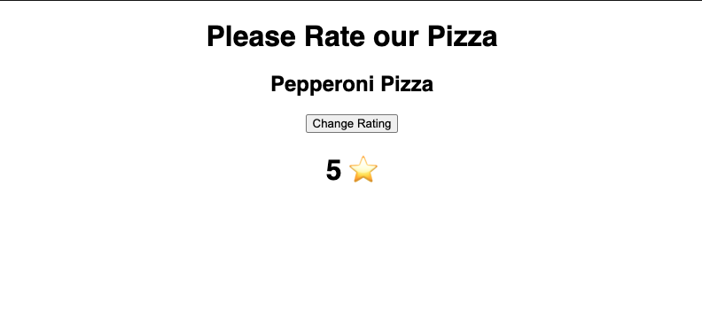

# Introduction

Long gone are the days when state management in react applications could only be archived through class-based components. With the addition of hooks in react 16.8, functional components were given the superpowers to manage state in an easy and clean way as compared to the class-based component approach.<br/>
With the introduction of useState and useEffect, one is able to mimic lifecycle methods inside functional-based components.

### PROBLEM

Prior to Hooks, functional components were stateless hence state needed to be passed down to this components through props. In a case where the application was too large, prop drilling was an impediment one had to face.<br>
React provides you with 10 hooks functions out of the box, in this article, our main focus will be the use of <b>useState</b> and <b>useEffect</b>.

## <b>useState hook</b>

The useState hook is a function that takes one parameter, which is the original state, and returns two values: the current state and the function that can be used to change the state.

Example

```js
import React, { useState } from 'react';

export default function App() {
  const [rating, setRating] = useState(0);
  return (
    <div className="App">
      <h1>Please Rate our Pizza </h1>
      <h2> Pepperoni Pizza</h2>
      <button onClick={() => setRating(rating + 1)}>Change Rating</button>
      <h1>{rating}⭐</h1>
    </div>
  );
}
```

The above code will reproduce the following output :



A Codesandbox demo can be found [HERE](https://plkcu.csb.app/)

Notice the use of square brackets when state variable is declared. This is the ES6 array destructuring syntax, and it means we’re assigning the first element of the array returned by useState to rating and the second element to setRating variable. This means we have a state named rate and we can update it by calling on setRate() function as shown above.

setRate adjusts the value of the rate by incrementing one to the previous value. So every time you click the button the rate
increments. From the above example, useState hook has demonstrated how we can change and set the state of functional components.

## <b> useEffect hook </b>

The useEffect hook is a merger of componentDidMount, componentDidUpdate and componentWillUnmount class-based lifecycle methods. This hook is the ideal place to set up network requests, fetching data from API and removing listeners before the component is removed from the DOM.

useEffect runs after every render and most of the side effects like network requests and subscriptions are performed under this function.

The use effect hook has the following characteristics :

- Accepts two arguments, a function and a dependency array.
- Runs only when component mounts on the DOM (component is rendered on the screen) by default.
- First argument function can contain effectful code such as fetching posts from server and making available in the state.
- Second argument array can be empty or some values
- Leave it empty if you want to run useEffect when component mounts and unmounts (default behavior)
- If you want to run useEffect when certain values change, you can pass those values as dependencies in this array.

Below is an example of using useEffect hook used to fetch a list of todos from remote server. This example also shows how you can pass dependency array to controll when to run useEffect.

```js
import React, { useState, useEffect } from 'react';

const App = () => {
  const [todos, setTodos] = useState([]);
  const [action, setAction] = useState(false);

  const fetchTodosFromServer = async () => {
    const response = await fetch('https://jsonplaceholder.typicode.com/todos');
    const todos = await response.json();
    setTodos((prevState) => [...prevState, ...todos]);
  };

  useEffect(() => {
    fetchTodosFromServer();
  }, [action]);

  return (
    <div>
      <button onClick={() => setAction(!action)}>Refetch todos</button>
      <hr />
      <p>Total todos: {todos.length}</p>
      <hr />
      {todos.map((todo) => (
        <p key={todo.id}>{todo.title}</p>
      ))}
    </div>
  );
};
```

A Codesandbox demo can be found [HERE](https://codesandbox.io/s/heuristic-khorana-z9kx2?file=/src/App.js)

The function fetchTodosFromServer will run everytime the component rerenders.
The second argument of useEffect function is referred to as the “dependency array”. When the variable included inside the array didn’t change, the function passed as the first argument won’t be executed.

I hope this article somehow helped you to understand the basic concepts of hooks 😄.
